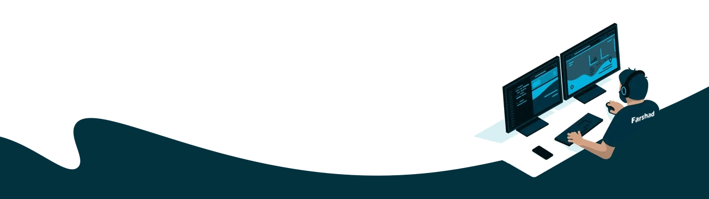

## Hi, I'm Farshad!

    

        <h3>My Professional skills 🎓</h3>
        <!-- Your badges and skills here -->
        
        
        
        
        
        
        
        
        
        
        
        
        <!-- Add more badges and skills as needed -->
    

    

      <h3> How to reach me:  🕽 </h3>
     
 
  
  

 
<h3>My GitHub Stats 📊 </h3>
 

